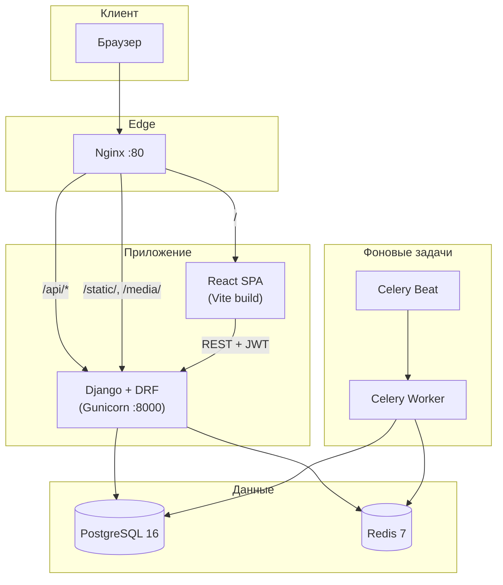

<div align="center">

# AssetGuard

**Комплексная платформа управления IT-активами — учёт оборудования, лицензий, обслуживания, амортизации и аудита под вашим контролем.**

[](https://www.python.org/)
[](https://www.djangoproject.com/)
[](https://www.django-rest-framework.org/)
[](https://react.dev/)
[](https://www.typescriptlang.org/)
[](https://vitejs.dev/)

[](https://www.postgresql.org/)
[](https://redis.io/)
[](https://docs.celeryq.dev/)
[](https://jwt.io/)

[](https://docs.docker.com/compose/)
[](https://nginx.org/)
[](https://gunicorn.org/)
[](LICENSE)

</div>

---

## Содержание

1. [О проекте](#1-о-проекте)
2. [Ключевые возможности](#2-ключевые-возможности)
3. [Технологический стек](#3-технологический-стек)
4. [Структура репозитория](#4-структура-репозитория)
5. [Архитектура и как это работает](#5-архитектура-и-как-это-работает)
6. [Доменная модель (крупными блоками)](#6-доменная-модель-крупными-блоками)
7. [Сервисы в Docker Compose](#7-сервисы-в-docker-compose)
8. [Быстрый старт (локально, Docker)](#8-быстрый-старт-локально-docker)
9. [Основные команды Docker Compose](#9-основные-команды-docker-compose)
10. [Ручной запуск frontend и backend](#10-ручной-запуск-frontend-и-backend)
11. [Конфигурация и переменные окружения](#11-конфигурация-и-переменные-окружения)
12. [API, очереди и интеграции](#12-api-очереди-и-интеграции)
13. [Мониторинг и эксплуатация](#13-мониторинг-и-эксплуатация)
14. [CI/CD](#14-cicd)
15. [Безопасность и хранение данных](#15-безопасность-и-хранение-данных)
16. [Роли компонентов в продакшене](#16-роли-компонентов-в-продакшене)
17. [Лицензия](#17-лицензия)
18. [Поддержка](#18-поддержка)

---

## 1. О проекте

**AssetGuard** — это production-ready система управления IT-активами (ITAM) для организаций, которым нужен единый источник правды по оборудованию, программному обеспечению и сопутствующим процессам.

Платформа закрывает полный жизненный цикл актива: от закупки и постановки на учёт до выдачи сотрудникам, обслуживания, амортизации, аудита и списания. Встроенные дашборды, отчёты и фоновые задачи снижают операционную нагрузку на IT-отдел, закупки и финансы.

**Целевая аудитория:**

| Роль | Сценарий использования |
|------|------------------------|
| **IT-администраторы** | Учёт железа, выдача/возврат, QR-метки, статусы активов |
| **Менеджеры закупок** | Поставщики, гарантии, плановое ТО |
| **Финансы** | Амортизация, балансовая стоимость, отчёты |
| **Compliance / аудит** | Журнал изменений, проверки соответствия |
| **Интеграторы** | REST API с OpenAPI (Swagger / ReDoc) |

### Что это за тип системы

AssetGuard — **распределённая многосервисная платформа**, а не монолитный скрипт. Логика разделена между API-сервером, SPA-интерфейсом, фоновыми воркерами и инфраструктурными сервисами (БД, кэш, брокер сообщений, reverse proxy).

| | |
|---|---|
| **Продукт** | B2B ITAM: активы, лицензии, ТО, амортизация, аудит, отчёты |
| **Архитектура** | Django REST API + React SPA + Celery + Nginx |
| **Хранилище** | PostgreSQL (метаданные и бизнес-логика) + Redis (кэш и брокер Celery) + тома Docker (media/static) |

---

## 2. Ключевые возможности

### Управление жизненным циклом активов
- Полный учёт оборудования и ПО с уникальными **asset tag**
- Иерархия **категорий** и **типов** активов
- Статусы: доступен, выдан, на обслуживании, списан, утерян и др.
- **Check-in / check-out** с историей назначений
- Генерация **QR-кодов** для физической маркировки
- Привязка к отделам, локациям и ответственным лицам

### Лицензии на ПО
- Учёт лицензий: количество мест, срок действия, продление
- Назначение на пользователей и устройства
- Автоматические **напоминания о продлении** (Celery Beat)
- Дашборды соответствия лицензий

### Обслуживание и гарантии
- Плановое и внеплановое ТО
- Управление гарантийными периодами и алертами об истечении
- Учёт затрат на обслуживание
- Справочник **поставщиков (vendors)**

### Финансы и амортизация
- Методы: **линейная** и **уменьшаемого остатка**
- Автоматическая генерация ежемесячных проводок (1-го числа)
- Расчёт текущей балансовой стоимости
- Отчёты по графику амортизации

### Аудит и соответствие
- Неизменяемый **журнал аудита** всех мутаций активов
- Плановые проверки compliance с результатами pass/fail
- История аудитов и отчётность

### Аналитика и отчёты
- Сводные дашборды по активам и утилизации
- Отчёты по амортизации с возможностью экспорта
- Отчёты по соответствию лицензий
- Анализ затрат на обслуживание

---

## 3. Технологический стек

### Backend
| Компонент | Технология | Назначение |
|-----------|------------|------------|
| Язык | Python 3.12+ | Серверная логика |
| Framework | Django 5.1 | ORM, admin, middleware |
| API | Django REST Framework 3.15 | REST endpoints |
| Auth | SimpleJWT | Access / Refresh токены, blacklist |
| Документация | drf-spectacular | OpenAPI 3, Swagger, ReDoc |
| Фильтрация | django-filter | Query-параметры для списков |
| Импорт/экспорт | django-import-export | Массовые операции в admin |
| WSGI | Gunicorn | Production HTTP-сервер |
| Статика | WhiteNoise | Сжатие и раздача static |

### Frontend
| Компонент | Технология | Назначение |
|-----------|------------|------------|
| UI | React 18 + TypeScript | SPA |
| Сборка | Vite 6 | Dev-сервер и production build |
| Стили | Tailwind CSS 3 | Utility-first CSS |
| Состояние | Zustand | Auth и локальное состояние |
| Данные | TanStack Query 5 | Кэширование API-запросов |
| HTTP | Axios | Клиент REST API |
| Формы | React Hook Form | Валидация форм |
| Графики | Recharts | Дашборды и визуализация |
| Маршрутизация | React Router 6 | Client-side routing |

### Инфраструктура
| Компонент | Технология | Назначение |
|-----------|------------|------------|
| БД | PostgreSQL 16 | Персистентные данные |
| Кэш / брокер | Redis 7 | Cache + Celery broker |
| Очереди | Celery 5 + Beat | Фоновые и периодические задачи |
| Proxy | Nginx 1.25 | Reverse proxy, gzip, static/media |
| Контейнеры | Docker Compose | Оркестрация локально и в prod-like среде |

---

## 4. Структура репозитория

```
AssetGuard/
├── backend/                      # Django-приложение
│   ├── apps/
│   │   ├── accounts/             # Пользователи, отделы, роли
│   │   ├── assets/               # Ядро: активы, категории, назначения
│   │   ├── licenses/             # Лицензии ПО и назначения
│   │   ├── maintenance/          # ТО, гарантии, журналы работ
│   │   ├── depreciation/         # Графики и проводки амортизации
│   │   ├── audits/               # Аудит-лог и compliance
│   │   ├── reports/              # Сводки и аналитика
│   │   └── vendors/              # Поставщики и контрагенты
│   ├── config/
│   │   ├── settings/             # base / development / production
│   │   ├── celery.py             # Celery + расписание Beat
│   │   └── urls.py               # Маршрутизация API
│   ├── utils/                    # Пагинация, обработка ошибок
│   ├── tests/                    # Pytest-тесты приложений
│   ├── requirements.txt
│   └── Dockerfile
├── frontend/                     # React SPA (Vite)
│   ├── src/
│   │   ├── api/                  # HTTP-клиенты по ресурсам
│   │   ├── components/           # UI-компоненты
│   │   ├── pages/                # Страницы приложения
│   │   ├── store/                # Zustand stores
│   │   ├── hooks/                # React Query hooks
│   │   └── styles/               # Глобальные стили
│   ├── package.json
│   └── Dockerfile
├── nginx/
│   └── nginx.conf                # Проксирование API и SPA
├── docker-compose.yml
├── .env.example
└── README.md
```

---

## 5. Архитектура и как это работает

### Общая схема



### Типичный запрос пользователя

1. Браузер загружает SPA через **Nginx** (`/`).
2. Пользователь входит через `/api/auth/login/` — получает **JWT** (access + refresh).
3. Frontend отправляет запросы к `/api/*` с заголовком `Authorization: Bearer <token>`.
4. **Django REST Framework** проверяет токен, применяет permissions и throttling.
5. Бизнес-логика работает с **PostgreSQL**; горячие данные кэшируются в **Redis**.
6. Долгие операции (email-уведомления, амортизация) выполняет **Celery Worker** по расписанию **Beat**.

### Периодические задачи (Celery Beat)

| Задача | Расписание | Описание |
|--------|------------|----------|
| `check_license_renewals` | Ежедневно 08:00 | Лицензии, истекающие в течение 30 дней |
| `check_warranty_expirations` | Ежедневно 08:15 | Гарантии, истекающие в течение 30 дней |
| `check_upcoming_maintenance` | Ежедневно 07:00 | ТО в ближайшие 7 дней |
| `generate_monthly_depreciation_entries` | 1-е число, 01:00 | Ежемесячные проводки амортизации |

---

## 6. Доменная модель (крупными блоками)

```
┌─────────────────────────────────────────────────────────────────┐
│                        ACCOUNTS                                 │
│  User · Department · Employee · Role (Admin/Manager/User)       │
└────────────────────────────┬────────────────────────────────────┘
                             │
┌────────────────────────────▼────────────────────────────────────┐
│                         ASSETS                                  │
│  AssetCategory → AssetType → Asset                                │
│  AssetAssignment (check-in/out) · Status · Condition · QR       │
└──────┬──────────────────┬──────────────────┬────────────────────┘
       │                  │                  │
┌──────▼──────┐   ┌───────▼───────┐  ┌──────▼──────┐
│  LICENSES   │   │ MAINTENANCE   │  │DEPRECIATION │
│ Software    │   │ Schedule      │  │ Schedule    │
│ License     │   │ MaintenanceLog│  │ Entry       │
│ Assignment  │   │ Warranty      │  │ (monthly)   │
└─────────────┘   └───────┬───────┘  └─────────────┘
                          │
                   ┌──────▼──────┐
                   │   VENDORS   │
                   │   Vendor    │
                   └─────────────┘

┌─────────────────────────────────────────────────────────────────┐
│  AUDITS          │  REPORTS (read-only aggregations)            │
│  AuditLog        │  asset-summary · depreciation · licenses    │
│  AuditSchedule   │                                             │
│  ComplianceCheck │                                             │
└─────────────────────────────────────────────────────────────────┘
```

Все ключевые сущности используют **UUID** в качестве первичного ключа — удобно для распределённой генерации и безопасного экспорта данных.

---

## 7. Сервисы в Docker Compose

| Сервис | Образ / сборка | Порт | Назначение |
|--------|----------------|------|------------|
| `db` | `postgres:16-alpine` | 5432 | Основная БД |
| `redis` | `redis:7-alpine` | 6379 | Кэш Django + брокер Celery |
| `backend` | `./backend` | 8000 | API (Gunicorn), миграции при старте |
| `celery_worker` | `./backend` | — | Асинхронные задачи |
| `celery_beat` | `./backend` | — | Планировщик (DatabaseScheduler) |
| `frontend` | `./frontend` | — | Сборка SPA в volume |
| `nginx` | `nginx:1.25-alpine` | 80, 443 | Единая точка входа |

**Именованные тома:** `postgres_data`, `redis_data`, `static_volume`, `media_volume`, `frontend_build`.

---

## 8. Быстрый старт (локально, Docker)

### Требования

- [Docker](https://docs.docker.com/get-docker/) и [Docker Compose](https://docs.docker.com/compose/) v2+
- [Git](https://git-scm.com/)

### Установка за 5 минут

```bash
# 1. Клонирование
git clone https://github.com/NodirOdilov/AssetGuard.git
cd AssetGuard

# 2. Конфигурация окружения
cp .env.example .env
# Отредактируйте SECRET_KEY, POSTGRES_PASSWORD и ALLOWED_HOSTS

# 3. Сборка и запуск
docker compose up --build -d

# 4. Создание суперпользователя
docker compose exec backend python manage.py createsuperuser
```

### Точки доступа

| Сервис | URL |
|--------|-----|
| **Веб-интерфейс** | http://localhost |
| **REST API** | http://localhost/api/ |
| **Django Admin** | http://localhost/api/admin/ |
| **Swagger UI** | http://localhost/api/docs/ |
| **ReDoc** | http://localhost/api/redoc/ |
| **OpenAPI Schema** | http://localhost/api/schema/ |

> Миграции БД выполняются автоматически при старте контейнера `backend`.

---

## 9. Основные команды Docker Compose

```bash
# Запуск всех сервисов
docker compose up -d

# Пересборка после изменений в коде
docker compose up --build -d

# Просмотр логов
docker compose logs -f backend
docker compose logs -f celery_worker

# Остановка
docker compose down

# Остановка с удалением томов (ОСТОРОЖНО: потеря данных БД)
docker compose down -v

# Миграции вручную
docker compose exec backend python manage.py migrate

# Создание суперпользователя
docker compose exec backend python manage.py createsuperuser

# Django shell
docker compose exec backend python manage.py shell

# Сбор статики
docker compose exec backend python manage.py collectstatic --noinput

# Запуск тестов backend
docker compose exec backend python -m pytest tests/ -v
```

---

## 10. Ручной запуск frontend и backend

Используйте для активной разработки без пересборки Docker-образов.

### Backend

```bash
cd backend
python -m venv venv

# Windows
venv\Scripts\activate
# Linux / macOS
source venv/bin/activate

pip install -r requirements.txt

# Убедитесь, что PostgreSQL и Redis запущены (можно только их из compose):
# docker compose up -d db redis

export DJANGO_SETTINGS_MODULE=config.settings.development   # Linux/macOS
set DJANGO_SETTINGS_MODULE=config.settings.development      # Windows CMD

python manage.py migrate
python manage.py runserver
```

### Celery (отдельные терминалы)

```bash
cd backend
celery -A config worker -l info
celery -A config beat -l info
```

### Frontend

```bash
cd frontend
npm install
npm run dev          # http://localhost:5173 (Vite dev server)
npm run build        # production-сборка
npm run preview      # предпросмотр сборки
npm run lint         # ESLint
npm run test         # Vitest
```

---

## 11. Конфигурация и переменные окружения

Скопируйте `.env.example` → `.env` и настройте под своё окружение.

| Переменная | Описание | Пример |
|------------|----------|--------|
| `DJANGO_SETTINGS_MODULE` | Модуль настроек Django | `config.settings.production` |
| `SECRET_KEY` | Криптографический ключ Django | Случайная строка ≥ 50 символов |
| `DEBUG` | Режим отладки | `0` в production |
| `ALLOWED_HOSTS` | Разрешённые хосты | `localhost,your-domain.com` |
| `CORS_ALLOWED_ORIGINS` | Origins для CORS | `https://your-domain.com` |
| `POSTGRES_*` | Параметры PostgreSQL | см. `.env.example` |
| `DATABASE_URL` | DSN подключения к БД | `postgres://user:pass@db:5432/assetguard` |
| `REDIS_URL` | URL кэша Django | `redis://redis:6379/0` |
| `CELERY_BROKER_URL` | Брокер Celery | `redis://redis:6379/1` |
| `CELERY_RESULT_BACKEND` | Backend результатов | `redis://redis:6379/2` |
| `EMAIL_*` | SMTP для уведомлений | Gmail / корпоративный SMTP |
| `REACT_APP_API_URL` | Base URL API для SPA | `/api` |
| `SECURE_SSL_REDIRECT` | Принудительный HTTPS | `1` в production |

Полный перечень — в файле [`.env.example`](.env.example).

---

## 12. API, очереди и интеграции

### Аутентификация (JWT)

| Метод | Endpoint | Описание |
|-------|----------|----------|
| `POST` | `/api/auth/login/` | Получение access + refresh токенов |
| `POST` | `/api/auth/refresh/` | Обновление access-токена |
| `POST` | `/api/auth/logout/` | Blacklist refresh-токена |

Access-токен живёт **30 минут**, refresh — **7 дней** (с ротацией и blacklist).

### Основные ресурсы

| Ресурс | Endpoint | Методы |
|--------|----------|--------|
| Пользователи | `/api/accounts/users/` | GET, POST |
| Отделы | `/api/accounts/departments/` | GET, POST, PUT, DELETE |
| Активы | `/api/assets/` | GET, POST, PUT, PATCH, DELETE |
| Категории | `/api/assets/categories/` | GET, POST, PUT, DELETE |
| Назначения | `/api/assets/assignments/` | GET, POST, PATCH |
| Лицензии | `/api/licenses/` | GET, POST, PUT, PATCH, DELETE |
| Назначения лицензий | `/api/licenses/assignments/` | GET, POST, DELETE |
| Расписание ТО | `/api/maintenance/schedules/` | GET, POST, PUT, DELETE |
| Журнал ТО | `/api/maintenance/logs/` | GET, POST |
| Гарантии | `/api/maintenance/warranties/` | GET, POST, PUT, DELETE |
| Графики амортизации | `/api/depreciation/schedules/` | GET, POST |
| Проводки амортизации | `/api/depreciation/entries/` | GET |
| Аудит-лог | `/api/audits/logs/` | GET |
| Расписание аудитов | `/api/audits/schedules/` | GET, POST, PUT |
| Compliance | `/api/audits/compliance/` | GET, POST |
| Поставщики | `/api/vendors/` | GET, POST, PUT, DELETE |
| Сводка активов | `/api/reports/asset-summary/` | GET |
| Отчёт амортизации | `/api/reports/depreciation/` | GET |
| Соответствие лицензий | `/api/reports/license-compliance/` | GET |

### Документация API

- **Swagger UI:** `/api/docs/`
- **ReDoc:** `/api/redoc/`
- **OpenAPI JSON:** `/api/schema/`

### Throttling

| Класс | Лимит |
|-------|-------|
| Anonymous | 100 запросов / час |
| Authenticated | 1000 запросов / час |

---

## 13. Мониторинг и эксплуатация

### Healthchecks

Docker Compose включает проверки готовности для `db` (`pg_isready`) и `redis` (`redis-cli ping`). Сервис `backend` стартует только после успешного healthcheck зависимостей.

### Логирование

- Консольный вывод для всех сервисов: `docker compose logs -f <service>`
- Файловый лог приложений: `backend/logs/assetguard.log` (уровень `DEBUG` для namespace `apps`)

### Рекомендуемые практики

| Область | Рекомендация |
|---------|--------------|
| Бэкапы | Ежедневный `pg_dump` тома `postgres_data` |
| Redis | Персистентность AOF/RDB при критичных очередях |
| Медиа | Резервное копирование тома `media_volume` |
| Секреты | Хранить `.env` вне Git; использовать vault в CI |
| Обновления | Тестировать миграции на staging перед prod |

---

## 14. CI/CD

В репозитории CI-пайплайн подключается на уровне организации. Рекомендуемый минимальный pipeline:

```yaml
# Пример .github/workflows/ci.yml
name: CI
on: [push, pull_request]
jobs:
  backend:
    runs-on: ubuntu-latest
    services:
      postgres: { image: postgres:16, env: { POSTGRES_PASSWORD: test } }
      redis: { image: redis:7 }
    steps:
      - uses: actions/checkout@v4
      - uses: actions/setup-python@v5
        with: { python-version: "3.12" }
      - run: pip install -r backend/requirements.txt
      - run: cd backend && pytest tests/ -v
  frontend:
    runs-on: ubuntu-latest
    steps:
      - uses: actions/checkout@v4
      - uses: actions/setup-node@v4
        with: { node-version: "20" }
      - run: cd frontend && npm ci && npm run build && npm run lint
```

**Деплой:** `docker compose -f docker-compose.yml up -d --build` на целевом сервере с настроенным `.env` и TLS-терминацией на Nginx.

---

## 15. Безопасность и хранение данных

| Механизм | Реализация |
|----------|------------|
| Аутентификация | JWT (SimpleJWT) с blacklist refresh-токенов |
| Авторизация | Role-based permissions в DRF |
| Пароли | Валидаторы Django (мин. 10 символов) |
| CORS | Явный whitelist origins |
| CSRF | Защита для session-auth endpoints |
| HTTPS | `SECURE_SSL_REDIRECT`, secure cookies в production |
| Rate limiting | DRF throttling (anon / user) |
| Аудит | Неизменяемый журнал всех мутаций активов |
| Медиафайлы | Том `media_volume`, раздача через Nginx |
| Статика | WhiteNoise + Nginx с cache headers |

> **Важно:** никогда не коммитьте `.env` с реальными `SECRET_KEY`, паролями БД и SMTP.

---

## 16. Роли компонентов в продакшене

| Компонент | Роль | Масштабирование |
|-----------|------|-----------------|
| **Nginx** | TLS-терминация, gzip, маршрутизация, static/media | Горизонтально за load balancer |
| **Gunicorn** | Синхронная обработка HTTP API | `--workers` ≈ 2×CPU + 1 |
| **Celery Worker** | Email, амортизация, проверки сроков | `--concurrency`, несколько реплик |
| **Celery Beat** | Один экземпляр планировщика | Строго single-instance |
| **PostgreSQL** | ACID-хранилище всех бизнес-данных | Реплика read-replica при росте нагрузки |
| **Redis** | Кэш + брокер; не источник правды | Sentinel / Cluster при HA |
| **React SPA** | Статические файлы после `vite build` | CDN для `frontend_build` |

---

## 17. Лицензия

Проект распространяется как **проприетарное программное обеспечение**. Все права защищены.

Использование, копирование и распространение без явного письменного разрешения правообладателя запрещены.

---

## 18. Поддержка

При возникновении вопросов или для сообщения об ошибках:

1. Проверьте [Issues](https://github.com/NodirOdilov/AssetGuard/issues) репозитория.
2. Приложите версию Docker, фрагмент логов (`docker compose logs`) и шаги воспроизведения.
3. Для вопросов по API используйте интерактивную документацию: http://localhost/api/docs/

---

<div align="center">

**AssetGuard** — порядок в IT-активах начинается с единого реестра.

*Сделано с вниманием к деталям для команд, которым важны контроль, прозрачность и соответствие.*

</div>
